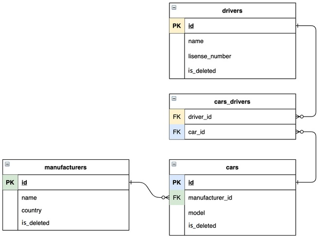

# 🚖Simple-taxi-service
This simple application is for storing cars, drivers and manufacturers models with relations between them.
# 🎯 Features
<lu>
<li>Registration and authentication for drivers (log in, log out).</li>
<li>CRUD operations for three models (driver, car, manufacturer).</li>
<li>Possibility to add drivers to car.</li>
<li>Possibility to display all drivers for car and all cars for authenticated driver.</li>
</lu>

# 📖Structure
N-tier structure (DAO, Service, Controller).
<lu>
<li>DAO - CRUD operation with database.</li>
<li>Service - business logic of application.</li>
<li>Controller - accept requests and send responses to browser.</li>
</lu>

# 🧬Technologies
<lu>
<li>Java</li>
<li>JDBC</li>
<li>JSP</li>
<li>MySQL 8.0.22</li>
<li>Tomcat 9.0.50</li>
<li>Maven 3.8.5</li>
</lu>

# ⚙️How to launch the project
<lu>
<li>Fork and clone this project from repository to your laptop.</li>
<li>Set up MySQL and create necessary tables by using file resources/init_db.sql.</li>
<li>Edit file taxi/util/ConnectionUtil with your field (USERNAME, PASSWORD, CONNECTION_URL).</li>
<li>Install and add Tomcat 9.0.50 to configuration.</li>
<li>Run project.</li>
</lu>
